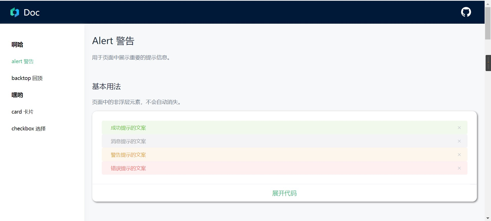

# vueui-doc-gen

[中文README](./README_zh.md)

## How to make sure you really need the project?

1. Do you have a custom UI library base on Vue2?
2. Do you want to have **ONLINE-DOCUMENT** for your UI library?
3. Do you think [the ElementUI doc](https://element.eleme.cn/#/en-US/component/installation) is very beautiful?
4. Do you want to have a same one and just need to edit markdown readme files?

OK, you need the project.

## Usage

Notice：The project has implemented a website template base on **Vue2**. It can generate your need.

A example dictionary:
```
my-ui-project
+--package               // Your UI library
|  +--carousel           // Your UI components
|  |  \---src
|  \---utils
+---config
|   |   index.js        // config file for vueui-doc-gen
|   |
|   \---docs            // Your markdown files what you want to translate to a ONLINE-DOCUMENT
|           alert.md
|           avatar.md
|           backtop.md
|           badge.md

```

### Install

NOTICE： Use **-D** / **--save-dev**

```
npm install -D vueui-doc-gen
```

### create a config file
a example config[config/index.js](./config/index.js)
```js
// my-ui-project/config/index.js

// Please use path.resolve to describe your files path
const path = require('path') 

module.exports = {
  output: path.resolve(__dirname, '../docs'), // the online-docment website's path
  usage: { // usage.importStr  tell the project how to regist your UI library
    importStr: `import ElementUI from 'element-ui'
import 'element-ui/lib/theme-chalk/index.css'
Vue.use(ElementUI)`
  },
  docs: [ // path to your readme
    {
      name: 'Aha', // first-level title， online-document has two levels
      components: [
        {
          name: 'alert', // second-level title
          location: path.resolve(__dirname, './docs/alert.md'),
          routerPath: '/alert' // unique router
        },
        {
          name: 'backtop',
          location: path.resolve(__dirname, './docs/backtop.md'),
          routerPath: '/backtop'
        }
      ]
    },
    {
      name: 'Yooo~',
      components: [
        {
          name: 'card',
          location: path.resolve(__dirname, './docs/card.md'),
          routerPath: '/card'
        },
        {
          name: 'checkbox',
          location: path.resolve(__dirname, './docs/checkbox.md'),
          routerPath: '/checkbox'
        }
      ]
    }
  ]
}

```

### generate

* preview(The usage **DOES NOT** generate output)
```shell scripts
cd my-ui-project
npx vueui-doc-gen --config ./config/index.js --mode dev
```

* generate
```shell script
cd my-ui-project
npx vueui-doc-gen --config ./config/index.js

```

## A Simple Online Example
[https://yuhang-dong.github.io/vueui-doc-gen/#/](https://yuhang-dong.github.io/vueui-doc-gen/#/)



